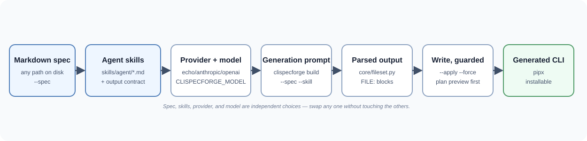

# CliSpecForge

[](#project-status)
[](https://github.com/lilabrooks/clispecforge/actions/workflows/tests.yml)
[](https://github.com/lilabrooks/clispecforge/actions/workflows/code-quality.yml)
[](https://github.com/lilabrooks/clispecforge/actions/workflows/coverage.yml)
[](https://github.com/lilabrooks/clispecforge/actions/workflows/snyk.yml)
[](#spec-workflow)
[](#skill-workflow)
[](#provider-design)
[](docs/guides/pipx-artifact-guide.md)

CliSpecForge is a small, single-pass generator for Python command-line tools.
It turns a Markdown CLI contract and optional instruction skills into a
reviewable file plan through Anthropic, OpenAI, or a local echo provider.
Generation ends after one model response; developers review, test, and iterate
on the resulting scaffold.

<details open>
<summary><strong>📖 Table of Contents</strong></summary>

- [What This Project Provides](#what-this-project-provides)
- [Flow](#flow)
- [Quick Start](#quick-start)
- [Configuration](#configuration)
  - [`CLISPECFORGE_PROVIDER`](#clispecforge_provider)
  - [`CLISPECFORGE_MODEL`](#clispecforge_model)
    - [How to choose a model](#how-to-choose-a-model)
  - [`CLISPECFORGE_MAX_TOKENS`](#clispecforge_max_tokens)
  - [`CLISPECFORGE_SYSTEM_PROMPT`](#clispecforge_system_prompt)
- [Development Setup](#development-setup)
- [Spec Workflow](#spec-workflow)
- [Skill Workflow](#skill-workflow)
- [Building Files from a Spec](#building-files-from-a-spec)
  - [Validating the spec before the model call](#validating-the-spec-before-the-model-call)
- [Step-by-Step: Generate a CLI from Any Spec File and Model](#step-by-step-generate-a-cli-from-any-spec-file-and-model)
  - [Steering the output shape](#steering-the-output-shape)
- [Generated CLI Fixture](#generated-cli-fixture)
- [Project Layout](#project-layout)
- [Provider Design](#provider-design)
- [Naming and Artifacts](#naming-and-artifacts)
- [Quality Standard](#quality-standard)
- [Additional Docs](#additional-docs)
- [Project Status](#project-status)

</details>

## What This Project Provides

You can use this CLI generator to describe a command-line tool as a plain Markdown spec and have an AI agent — on whichever model vendor you choose — turn it into a real, working Python CLI.

- Accepts a spec from anywhere on disk, not just one kept under this repo's own `specs/cli/` folder.
- Works with any model vendor: bundled adapters for Anthropic Claude, OpenAI, and a credential-free `echo` stub, swappable without touching application code.
- Lets you pick a specific model per vendor, independent of which provider is active.
- Applies reusable "skills" that steer how the agent implements, tests, packages, and shapes the UX of what it builds — attach one, several, or all of them.
- Validates a spec's required sections before spending a real model call on it, with a forgiving default and an optional strict mode.
- Shows a full preview of exactly which files a generation would produce before anything is written.
- Writes the generated files for real, refusing to silently overwrite anything already on disk.
- Runs entirely free of API keys and network access out of the box, and only needs credentials once you opt into a real model vendor.
- Ships as a proper, pipx-installable Python package, with its own generated example CLI proving the whole pattern works end to end.

## Flow



## Quick Start

Install the CLI locally with pip:

```bash
python -m pip install .
clispecforge providers
clispecforge run "Write a release note for version 0.1.0"
```

Install it as an isolated command with pipx:

```bash
pipx install .
clispecforge providers
clispecforge run "Write a release note for version 0.1.0"
```

Install directly from GitHub with pipx:

```bash
pipx install "git+https://github.com/lilabrooks/clispecforge.git"
clispecforge providers
```

The default specs and skills ship inside the package, so `clispecforge spec` and `clispecforge skill` work from any directory after install. For a complete pipx and artifact guide, see [docs/guides/pipx-artifact-guide.md](docs/guides/pipx-artifact-guide.md).

## Configuration

Four environment variables adjust runtime behavior. They are read directly from the process environment, so set them in your shell before running. There is no `.env` auto-loading.

You can set a variable for a single command by prefixing it, or export it to apply to every command in the shell session:

```bash
# One command only
CLISPECFORGE_PROVIDER=echo clispecforge run "Write a release note for version 0.1.0"

# Whole session
export CLISPECFORGE_PROVIDER=echo
clispecforge run "Write a release note for version 0.1.0"
```

### `CLISPECFORGE_PROVIDER`

Chooses which provider adapter answers the prompt. Default is `echo`. Run `clispecforge providers` to see the adapters that are installed.

Precedence is `--provider` flag, then `CLISPECFORGE_PROVIDER`, then the `echo` default. So the flag wins when both are set:

```bash
export CLISPECFORGE_PROVIDER=echo
clispecforge run --provider echo "hello"     # --provider wins over the env var
```

An unknown provider fails fast with the list of supported names:

```bash
$ clispecforge run --provider gpt "hello"
Error: Unknown provider 'gpt'. Supported providers: anthropic, echo, openai.
Try 'clispecforge providers' to see available providers.
```

Bundled adapters: `echo` (no credentials or network access), `anthropic` (Claude API, needs `pip install ".[anthropic]"` and an `ANTHROPIC_API_KEY`), and `openai` (Chat Completions API, needs `pip install ".[openai]"` and an `OPENAI_API_KEY`). Add further vendors under `src/agent_cli/providers/` and register them (see [Provider Design](#provider-design)).

**An API key only matters once you've actually selected that provider.** `ANTHROPIC_API_KEY`/`OPENAI_API_KEY` are read by the `anthropic`/`openai` SDKs themselves, not by this CLI, and only the moment `CLISPECFORGE_PROVIDER` (or `--provider`) is set to that provider's name — the default `echo` never looks at either variable, so having one exported with `CLISPECFORGE_PROVIDER` still unset (or set to `echo`) is a no-op.

It does **not** need to be set globally. Like the other variables in this section, it only has to be present in the process environment for the command that runs — export it in your shell profile if you always want it available, prefix a single command with it if you don't, or set it in a `.env`-loading tool of your own (this project doesn't auto-load one). There's nothing to configure inside the CLI itself; whatever `ANTHROPIC_API_KEY`/`OPENAI_API_KEY` is visible to the process at run time is what the SDK picks up.

### `CLISPECFORGE_MODEL`

Overrides which model the active provider adapter calls. There is no CLI flag, so the env var or the adapter's built-in default is used:

```bash
export CLISPECFORGE_PROVIDER=anthropic
export CLISPECFORGE_MODEL=claude-sonnet-5
clispecforge run "Summarize the changes in version 0.1.0"
```

If unset, each adapter falls back to its own default: `anthropic` → `claude-opus-4-8`, `openai` → `gpt-4o-mini`. The `echo` adapter has no underlying model and ignores this variable entirely.

**`CLISPECFORGE_MODEL` alone does nothing.** It only takes effect on whichever provider `CLISPECFORGE_PROVIDER`/`--provider` actually selects. Setting `CLISPECFORGE_MODEL=claude-sonnet-5` while the provider is still (or defaults to) `echo` is a silent no-op — you'll get the same echoed text either way, with no error to flag the mismatch. Always set both together:

```bash
# Wrong: model is set, but the provider is still the echo default — no effect
export CLISPECFORGE_MODEL=claude-sonnet-5
clispecforge run "hello"   # still runs through echo

# Right: provider and model set together
export CLISPECFORGE_PROVIDER=anthropic
export CLISPECFORGE_MODEL=claude-sonnet-5
clispecforge run "hello"   # now actually calls claude-sonnet-5
```

#### How to choose a model

1. **Pick a provider first.** Model selection only matters once `CLISPECFORGE_PROVIDER` is set to `anthropic` or `openai` — pick whichever vendor you have API access to.
2. **Start with the adapter's default and see if it's good enough.** Leaving `CLISPECFORGE_MODEL` unset gets you a reasonable starting point (`claude-opus-4-8` for `anthropic`, `gpt-4o-mini` for `openai`) without any extra configuration.
3. **Decide what you're optimizing for** if you want to change it:
   - **Highest quality, cost no object** — `anthropic`: `claude-opus-4-8`. `openai`: `gpt-4o`.
   - **Balanced quality, cost, and speed for everyday tasks** — `anthropic`: `claude-sonnet-5`. `openai`: `gpt-4o-mini`.
   - **Fastest and cheapest, for simple or high-volume tasks** — `anthropic`: `claude-haiku-4-5`. `openai`: `gpt-4o-mini`.
4. **Set `CLISPECFORGE_MODEL` to that model's exact ID.** Model IDs are vendor-specific strings (e.g. `claude-sonnet-5`, `gpt-4o`) — check your provider's model documentation for the current list, since vendors add and retire models over time.
5. **Verify it took effect** by running a prompt (`clispecforge run --provider anthropic "hello"`). An invalid or retired model ID surfaces as an error from the vendor's SDK, which confirms the override is being read.

### `CLISPECFORGE_MAX_TOKENS`

Sets the maximum number of output tokens requested from Anthropic or OpenAI.
The default is `4096`; the value must be a positive integer. The echo provider
ignores it.

```bash
export CLISPECFORGE_PROVIDER=openai
export CLISPECFORGE_MAX_TOKENS=8192
clispecforge build "Create a small Python CLI"
```

If a provider reports that it stopped at this limit, the command exits with an
error instead of parsing or writing the partial response. Increase the value
and issue the command again if the provider and selected model support it. The
CLI does not retry automatically.

### `CLISPECFORGE_SYSTEM_PROMPT`

Sets the system prompt sent to the agent ahead of your task. Default is `You are a concise, practical assistant.`. There is no CLI flag for it, so the env var or the default is used.

```bash
export CLISPECFORGE_SYSTEM_PROMPT="You are a terse release-notes writer. Use past tense."
clispecforge run "Summarize the changes in version 0.1.0"
```

Heads-up: the bundled `echo` adapter replies with your task text verbatim and ignores the system prompt, so this variable has no visible effect until you wire up a real model adapter that passes the prompt to the model.

## Development Setup

Built and developed on Python 3.14.6. The project supports 3.12+, and CI runs against 3.12, 3.13, and 3.14. Use any interpreter in that range (`python3.14` shown here):

```bash
python3.14 -m venv .venv
source .venv/bin/activate
python -m pip install -e ".[dev]"
```

Run lint, type-check, and tests on the active interpreter with a single command:

```bash
make check
```

`make check` uses tools from `.venv/bin/` when that virtualenv exists, so it works from a normal shell after the editable install without manually prefixing `PATH`. If an optional quality target reports a missing dev tool, refresh the environment with `python -m pip install -e ".[dev]"`.

The underlying tools can also be run individually:

```bash
pytest
ruff check .
ruff format --check .
mypy
```

To run the full check across every supported Python version the way CI does, use `make check-all` (needs [uv](https://docs.astral.sh/uv/), which fetches the interpreters on demand). Save it for reproducing a version-specific failure that CI flags.

Run the CLI locally:

```bash
clispecforge providers
clispecforge spec check
clispecforge skill check
```

Heads-up: `pip install -e ".[dev]"` is an **editable** install, so `clispecforge` runs straight from `src/` and never triggers a wheel build. That means the bundled copy of `specs/` and `skills/` under `agent_cli/_bundled/` (see [`resources.py`](src/agent_cli/resources.py)) does not exist yet — `default_spec_root()`/`default_skill_root()` fall back to the checkout's own `specs/cli/` and `skills/agent/`, so spec/skill slugs and `clispecforge build`'s automatic `file-output-contract` attachment only resolve while your current directory is inside this checkout. Run a real (non-editable) install — `pip install .` or `pipx install .` — to get the bundled copy and use `clispecforge` from any directory instead. `--spec`/`--skill` pointed at an explicit file path work either way, since that path is checked before any root lookup.

### Dependency scanning

`requirements.txt` exists for GitHub-based dependency scanners such as Snyk. The application runtime still has no required third-party dependencies; the file mirrors the optional provider SDKs and development tools from `pyproject.toml` so scanners that look for a root pip manifest have concrete packages to inspect.

Use `pyproject.toml` as the source of truth when changing dependencies. If you add, remove, or bump packages in `[project.optional-dependencies]`, update `requirements.txt` in the same change. Do not install from `requirements.txt` for normal development; use the editable install shown above:

```bash
python -m pip install -e ".[dev]"
```

To reproduce Snyk dashboard findings locally, install the Snyk CLI, authenticate with `snyk auth`, and run:

```bash
make snyk
```

The combined target runs both scans that matter for this repo:

```bash
make snyk-open-source  # dependency and license findings from requirements.txt
make snyk-code         # source-code findings from Snyk Code
```

If your Snyk account has multiple organizations, pass the same org used by the dashboard project:

```bash
make snyk SNYK_ORG=<org-slug-or-id>
```

The Open Source target uses `.venv/bin/python` when that virtualenv exists, because Snyk's Python scanner shells out to Python to resolve dependency data. If you use another interpreter, pass it explicitly:

```bash
make snyk-open-source SNYK_PYTHON=/path/to/python
```

Prefer `make snyk-open-source` over a bare `snyk test`. Snyk resolves the pip tree by running a `python` interpreter that must have the `requirements.txt` packages installed, and a bare invocation supplies neither the interpreter nor the packages:

- `SNYK-CLI-0000` / `spawn python ENOENT` — no `python` on `PATH` (macOS ships only `python3`). Run `source .venv/bin/activate` first, or use `make snyk-open-source`, which passes `--command=.venv/bin/python`.
- `SNYK-OS-PYTHON-0013` (Missing required packages) — the `python` being used has no runtime deps installed (the venv installs only `[dev]` by default). `make snyk-open-source` installs `requirements.txt` into the interpreter before scanning; an activated venv works too once those packages are installed.

For dependency findings, update `pyproject.toml` first, then mirror the same package change in `requirements.txt`. If Snyk flags a vulnerable transitive dependency from an optional provider SDK, add a direct lower-bound constraint to the relevant extra and mirror it in `requirements.txt`; for example, the `openai` extra constrains `anyio>=4.4.0`, `h11>=0.16.0`, `idna>=3.15`, and `zipp>=3.19.1` to avoid vulnerable resolver choices through its transitive dependencies. For Snyk Code findings, change the source or tests directly. Use `snyk ignore` only for Open Source findings that have a documented reason and expiry; Snyk's local `.snyk` issue ignores do not apply to Snyk Code findings.

## Spec Workflow

Write CLI requirements as Markdown specs in `specs/cli/`. Use `specs/templates/cli-spec.md` as the starting point.

Each spec should include:

- `Purpose`
- `Commands`
- `Inputs`
- `Outputs`
- `Behavior`
- `Acceptance tests`

The installed package ships with default specs. A `specs/cli` folder in your current directory takes precedence, so a checkout or your own project can override them.

Validate specs:

```bash
clispecforge spec check
clispecforge spec check my-cli-details
```

Attach a spec to a run:

```bash
clispecforge run --spec my-cli-details "Implement this CLI feature"
```

`--spec` is not limited to slugs under `specs/cli/` — it accepts any file path, absolute or relative, so you can point it at a spec you keep anywhere on disk (a scratch file, another project, a path outside this repo entirely):

```bash
clispecforge run --spec /path/to/any/weather-cli.md "Implement this CLI feature"
clispecforge build --spec ./drafts/weather-cli.md --apply "Implement this CLI feature"
```

Resolution tries, in order: the exact path given, that path under the spec root, that path with `.md` appended under the spec root, then a slug match under the spec root. An arbitrary path that exists is used as-is and skips the rest of that lookup.

## Skill Workflow

Agent skills live in `skills/agent/`. They describe how the agent should work while implementing a CLI spec.

Included skills adapted from `multica-ai/andrej-karpathy-skills`:

- `think-before-coding`
- `focused-implementation`
- `goal-driven-execution`

Python and CLI quality skills:

- `python-code-quality`
- `stdlib-cli-ux`
- `cli-test-coverage`
- `python-packaging-cli`
- `file-output-contract` (used automatically by `clispecforge build`; see [Building Files from a Spec](#building-files-from-a-spec))

As with specs, default skills ship inside the package, and a `skills/agent` folder in your current directory takes precedence.

Skills are opt-in by default. Attach selected skills with a spec:

```bash
clispecforge run --spec my-cli-details --skill goal-driven-execution --skill stdlib-cli-ux "Implement this feature"
```

Attach every available skill:

```bash
clispecforge run --spec my-cli-details --all-skills "Implement this feature"
```

## Building Files from a Spec

`clispecforge run` only prints the model's text reply — nothing lands on disk. `clispecforge build` closes that gap: it runs the same spec/skill-aware prompt as `run`, but always attaches an extra `file-output-contract` skill that tells the model to reply with `FILE: <path>` markers followed by a fenced code block per file. `clispecforge build` parses that reply and can write the files it finds.

Without `--apply`, it only prints the plan (which files, and where) so you can review before anything is written:

```bash
clispecforge build --spec my-cli-details "Implement this CLI feature"
```

Add `--apply` to actually write the files, under `--out-dir` (defaults to the current directory):

```bash
clispecforge build --spec my-cli-details --apply --out-dir . "Implement this CLI feature"
```

To keep the write step safe by default, `clispecforge build --apply` refuses to overwrite any file that already exists unless you also pass `--force`:

```bash
$ clispecforge build --apply "Implement this CLI feature"
Error: Refusing to overwrite existing file(s) without --force: src/agent_cli/commands/my_cli.py
```

Generated paths are rejected when they are absolute, contain parent traversal,
or resolve outside `--out-dir` through a symbolic link. Duplicate targets are
also rejected before any file is written. A `FILE:` block without a closing
fence is treated as incomplete and ignored.

If the model's reply has no `FILE:` blocks (for example, it just answered a question instead of writing code), `clispecforge build` prints the raw reply and warns on stderr that there was nothing to write — it never fails in that case.

`clispecforge build` accepts the same `--provider`, `--spec`, `--skill`, and `--all-skills` flags as `clispecforge run`.

### Validating the spec before the model call

Since `--spec` accepts any file, including one you just wrote by hand, `clispecforge build` checks it against the same required sections as `clispecforge spec check` before spending a model call on it. By default a spec with errors (missing title, missing a required section) only prints a warning to stderr and the build continues — a spec doesn't have to be perfect to be useful context:

```bash
$ clispecforge build --spec ./drafts/weather-cli.md "Implement this CLI feature"
Warning: spec drafts/weather-cli.md has validation errors:
drafts/weather-cli.md: failed
  Error: missing required section: Acceptance tests
Continuing without --strict. Run 'clispecforge spec check' for the full report.
```

Pass `--strict` to fail fast instead, before any model call is made:

```bash
$ clispecforge build --spec ./drafts/weather-cli.md --strict "Implement this CLI feature"
Error: Spec drafts/weather-cli.md failed validation:
drafts/weather-cli.md: failed
  Error: missing required section: Acceptance tests
Try 'clispecforge spec check drafts/weather-cli.md' to see the full report.
```

## Step-by-Step: Generate a CLI from Any Spec File and Model

This walks through the full path end to end: a spec file that lives anywhere on disk, a specific provider and model, and a generated CLI written to a folder of your choice.

If you're working from an editable dev install (`pip install -e ".[dev]"`), run these commands from inside this checkout — see the note in [Development Setup](#development-setup) on why editable installs need that and a non-editable install doesn't.

1. **Write the spec anywhere on disk.** It does not need to live under this repo's `specs/cli/` — a spec in your home directory, another project, or a scratch folder works the same way. Use [specs/templates/cli-spec.md](specs/templates/cli-spec.md) as the starting shape:

   ```bash
   mkdir -p ~/drafts
   cat > ~/drafts/weather-cli.md <<'EOF'
   ---
   status: draft
   owner: you
   ---
   # weather-cli

   ## Purpose
   A CLI that prints a canned weather report for a city.

   ## Commands
   - `weather-cli today --city <name>`

   ## Inputs
   - `--city`: required city name.

   ## Outputs
   A line of text: `<city>: Sunny, 72F`.

   ## Behavior
   Always print the same canned line for any city.

   ## Acceptance tests
   - Given `--city Boston`, stdout is `Boston: Sunny, 72F`.
   EOF
   ```

2. **Validate the spec before spending a model call on it** (optional, but recommended for a hand-written spec):

   ```bash
   clispecforge spec check ~/drafts/weather-cli.md
   ```

3. **Install a real provider's SDK and set its credentials.** The bundled `echo` provider only echoes text back, so an actual generation step needs `anthropic` or `openai`:

   ```bash
   python -m pip install ".[anthropic]"
   export ANTHROPIC_API_KEY="sk-ant-..."
   ```

4. **Choose the provider and model** with the env vars from [Configuration](#configuration):

   ```bash
   export CLISPECFORGE_PROVIDER=anthropic
   export CLISPECFORGE_MODEL=claude-sonnet-5
   ```

5. **Preview the plan first**, without writing anything, by pointing `--spec` at the file from step 1:

   ```bash
   clispecforge build --spec ~/drafts/weather-cli.md "Implement the weather-cli command described in this spec"
   ```

   ```text
   Plan: 2 file(s) under .:
     ./weather_cli.py
     ./tests/test_weather_cli.py
   Re-run with --apply to write these files.
   ```

   That exact file list is illustrative, not guaranteed. `clispecforge build` doesn't scaffold any structure of its own — it writes whatever `FILE: <path>` blocks the model's reply contains, wherever the model puts them. A different model, a different task sentence, or different attached skills can just as easily produce one bare script or a full installable package. See [Steering the output shape](#steering-the-output-shape) below to make the shape you want explicit instead of leaving it to the model to guess.

6. **Apply it**, directing the output into a project folder with `--out-dir`:

   ```bash
   clispecforge build --spec ~/drafts/weather-cli.md --apply --out-dir ./weather-cli-project \
     "Implement the weather-cli command described in this spec"
   ```

   ```text
   Wrote weather-cli-project/weather_cli.py
   Wrote weather-cli-project/tests/test_weather_cli.py
   ```

7. **Use the generated CLI** the same way you would any other Python script or package it produced.

Re-running step 6 refuses to overwrite those same files unless you add `--force` — see [Building Files from a Spec](#building-files-from-a-spec) for that safeguard, [Spec Workflow](#spec-workflow) for more on the `--spec` path resolution, and [`CLISPECFORGE_MODEL`](#clispecforge_model) for how to pick a model per provider.

### Steering the output shape

`clispecforge build` has no opinion on project shape — a script, a package, one file, ten files, all come from the same `FILE:` contract. The two levers that actually decide the shape are the spec's `Outputs` section (state what you want, don't leave it implicit) and which skills are attached (`python-packaging-cli` in particular nudges the model toward packaging conventions instead of a bare script).

**Loose script (what step 5 assumed):** leaving `Outputs` vague and attaching no skills tends to produce the smallest thing that satisfies `Acceptance tests` — often one script plus one test file, as shown above.

**Installable package:** to reliably get a real package instead, be explicit in both the spec and the task, and attach the packaging skill:

```bash
cat > ~/drafts/weather-cli.md <<'EOF'
---
status: draft
owner: you
---
# weather-cli

## Purpose
A CLI that prints a canned weather report for a city.

## Commands
- `weather-cli today --city <name>`

## Inputs
- `--city`: required city name.

## Outputs
Ship as an installable Python package, not a bare script:
- `pyproject.toml` with a `weather-cli` console-script entry point.
- `src/weather_cli/cli.py` exposing a `main()` function as that entry point.
- `tests/test_cli.py` covering the acceptance tests below.

## Behavior
Always print `<city>: Sunny, 72F` for any city.

## Acceptance tests
- Given `--city Boston`, stdout is `Boston: Sunny, 72F`.
EOF

clispecforge build --spec ~/drafts/weather-cli.md --skill python-packaging-cli --skill stdlib-cli-ux \
  --apply --out-dir ./weather-cli-project \
  "Implement the weather-cli command described in this spec as an installable Python package"
```

```text
Wrote weather-cli-project/pyproject.toml
Wrote weather-cli-project/src/weather_cli/cli.py
Wrote weather-cli-project/tests/test_cli.py
```

Same command, same tool — the difference is entirely in what the spec asked for and which skills primed the model's reply. `--all-skills` is the blunter version of the same idea: attach everything (`python-code-quality`, `cli-test-coverage`, `stdlib-cli-ux`, `python-packaging-cli`, etc.) when you want the fuller quality bar this project itself follows, rather than hand-picking one skill.

## Generated CLI Fixture

The repo includes a small generated CLI fixture named `my-cli`. It prints non-sensitive host machine details and exists as a test case for the generator structure. It is kept out of the installed command surface and runs directly from the checkout:

```bash
python -m agent_cli.commands.my_cli --basic
python -m agent_cli.commands.my_cli --detailed
```

The fixture spec is [specs/cli/my-cli-details.md](specs/cli/my-cli-details.md). The step-by-step test guide is [docs/guides/my-cli-generator-test.md](docs/guides/my-cli-generator-test.md).

## Project Layout

```text
.
├── src/agent_cli/
│   ├── cli.py              # Main `clispecforge` command surface
│   ├── agents/             # Agent behavior and orchestration
│   ├── commands/           # Generated or fixture CLI command modules
│   ├── config/             # Settings and environment loading
│   ├── core/               # Vendor-neutral contracts, shared types, Markdown parsing, file-output parsing (`fileset.py`)
│   ├── providers/          # Model/provider adapters
│   ├── runtime/            # Composition root for wiring objects together
│   ├── skills/             # Markdown skill loading and validation
│   └── specs/              # Markdown spec loading and validation
├── skills/
│   ├── agent/              # Agent working-style skills
│   └── templates/          # Reusable skill templates
├── specs/
│   ├── cli/                # CLI specs the agent can work from
│   └── templates/          # Reusable spec templates
├── tests/                  # Fast unit tests
├── docs/                   # Design notes, decisions, guides, and research
├── requirements.txt        # Snyk-friendly scan manifest; mirrors optional/dev deps
└── pyproject.toml          # Packaging, tools, and CLI entry points
```

## Provider Design

The project keeps provider details behind one small protocol:

```python
class LanguageModel(Protocol):
    def complete(self, request: CompletionRequest) -> CompletionResponse: ...
```

Agents receive a `LanguageModel` instance instead of constructing provider clients directly. That keeps the CLI, agent logic, tests, and future provider adapters loosely coupled.

To add a real vendor, implement `LanguageModel` under `src/agent_cli/providers/` and register it in `src/agent_cli/providers/registry.py`. The factory, the unknown-provider error, and the `providers` command all read from that registry.

## Naming and Artifacts

The distribution and installed command share one public name:

- Distribution package: `clispecforge`
- Installed command: `clispecforge`

Build artifacts use the distribution package name normalized for Python packaging. That is why `python -m build` creates files like:

```text
clispecforge-0.4.0.tar.gz
clispecforge-0.4.0-py3-none-any.whl
```

The installed command is:

```bash
clispecforge providers
```

## Quality Standard

Use pytest for behavior tests. Prefer function-level tests with fixtures such as `tmp_path`, `capsys`, and `monkeypatch`.

Ruff handles linting and formatting, and mypy runs in strict mode. Run them together with `make check`, or individually as shown in [Development Setup](#development-setup).

Runtime code should stay dependency-free unless a spec requires a dependency. Development-only tools belong in the `dev` optional dependency group.

`requirements.txt` is for dependency scanners, not the install contract. Keep it in sync with optional and development dependencies in `pyproject.toml` whenever those packages change, including any direct lower-bound constraints added to keep transitive dependencies on fixed versions.

When Snyk reports a new issue, reproduce it locally with `make snyk-open-source` or `make snyk-code`, fix it, then run `make check` before committing.

## Additional Docs

- [CHANGELOG.md](CHANGELOG.md)
- [CONTRIBUTING.md](CONTRIBUTING.md)
- [docs/design.md](docs/design.md)
- [docs/decisions.md](docs/decisions.md)
- [docs/guides/pipx-artifact-guide.md](docs/guides/pipx-artifact-guide.md)
- [docs/guides/my-cli-generator-test.md](docs/guides/my-cli-generator-test.md)
- [skills/README.md](skills/README.md)
- [specs/README.md](specs/README.md)

## Project Status

This is a personal side project, maintained on a best-effort basis rather than a supported product. Tests, linting, and type-checking run on every change, but there's no SLA on response time — issues and pull requests are welcome, and may take a while to get to.
